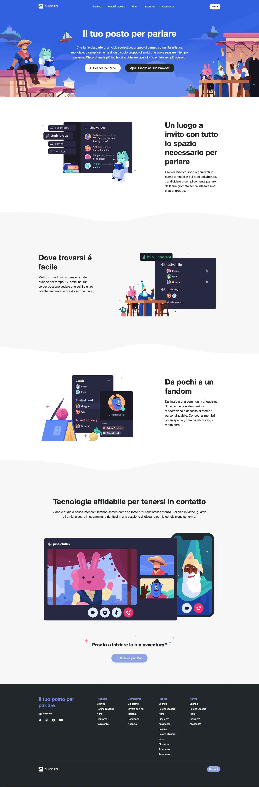

Ottavo Esercizio Classe #137 - Boolean
===
Studente: Fabio Ferrero

---
# English

## Target of the project:
Replicate a complex web page using the layout created on <a href="https://github.com/fabioferrero90/htmlcss-struttura-discord">exercise #7</a> from a screenshot

---
# Italiano

## Obiettivo del progetto:
Replicare una pagina web complessa usando il layout creato nell'<a href="https://github.com/fabioferrero90/htmlcss-struttura-discord">esercizio #7</a>  da uno screenshot

---

---

---
<strong>Lo screenshot fornito dal coach è il seguente:</strong>

